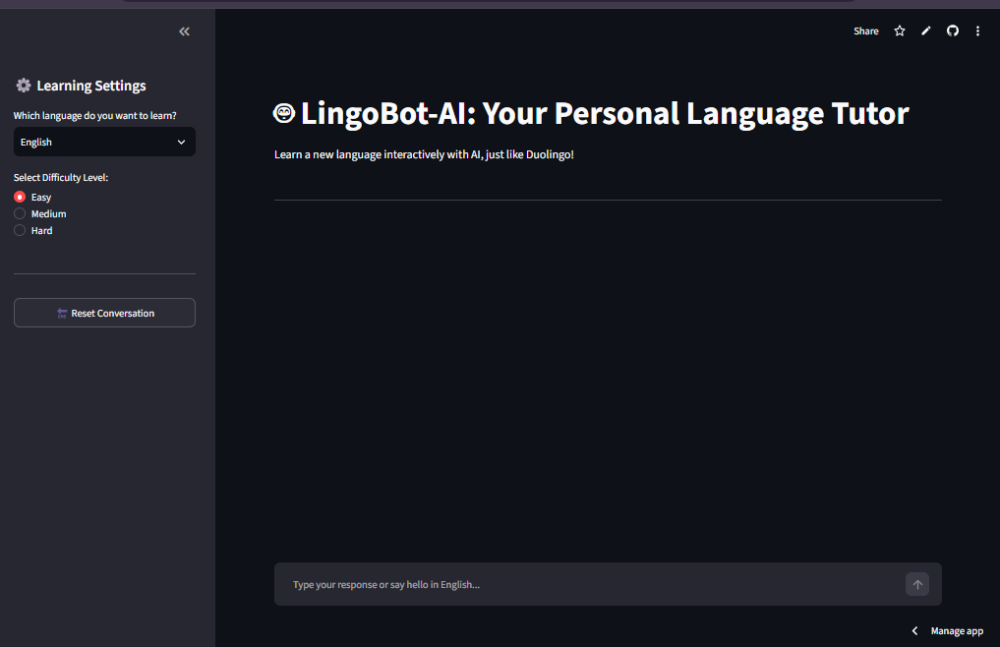

# 🤖 LexiLearn-AI: Your Personal AI Language Tutor

LexiLearn-AI is a smart, interactive language learning application inspired by Duolingo. It helps users master new languages through conversational AI, providing real-time grammar feedback and adaptive difficulty stages.

## 🚀 Live Application

You can try the live app here: **[[Insert Live Link Here]]**

## 📸 Application Preview


_(Tip: Replace 'preview.png' with your image path or GitHub asset link)_

## ✨ Features

- **Adaptive Learning:** Choose between Easy, Medium, and Hard difficulty levels.
- **Smart Language Detection:** Instantly detects and corrects Hindi/Hinglish inputs when learning other languages.
- **Modulated Architecture:** Separated backend logic and Streamlit UI for seamless performance.
- **Memory Management:** Efficient conversation history tracking with automatic memory optimization.

## 📁 Project Structure

```text
lexilearn-ai/
│
├── .env                  # Fresh Mistral API Key (Keep it safe)
├── .gitignore            # Excludes .env and .venv from GitHub
├── requirements.txt      # Lightweight dependencies (Streamlit, LangChain)
├── backend.py            # LLM Logic & Dynamic Prompts
├── frontend.py           # Streamlit UI Components
├── UI.py                 # UI image
└── main.py               # Main Entry Point
```

<!-- ## Cloning the Repository

To clone the repository, run the following command:

```bash
git clone https://github.com/amirsohail100/LexiLearn-AI.git
```

## 💻 Installation

1. Install Python 3.10 or higher.
2. Install the required dependencies:

```bash
pip install -r requirements.txt
```

3.  Create a `.env` file in the project root directory and add your Mistral API key:

```bash
MISTRAL_API_KEY = "your_api_key_here"
```

4. Run the application:

```bash
streamlit run main.py
```

## 📝 License

This project is licensed under the MIT License. See the [LICENSE](LICENSE) file for details.

## 🙏 Acknowledgements

- Thanks to [Mistral AI](https://mistral.ai/) for providing the Mistral API.
- Thanks to [LangChain](https://github.com/hwchase17/langchain) for the LangChain library.
- Thanks to [Streamlit](https://github.com/streamlit/streamlit) for the Streamlit library. -->

LexiLearn-AI is an interactive AI-powered language tutor inspired by Duolingo. Built with Streamlit and Mistral AI, it supports multi-language learning with dynamic difficulty levels (Easy, Medium, Hard). It features instant grammar correction, smart Hinglish/Hindi mistake detection, and a clean chat interface. 🚀
